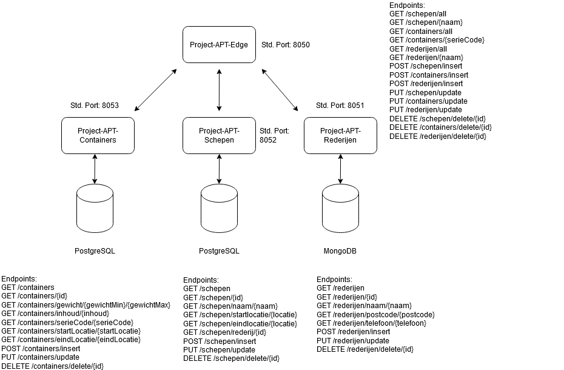
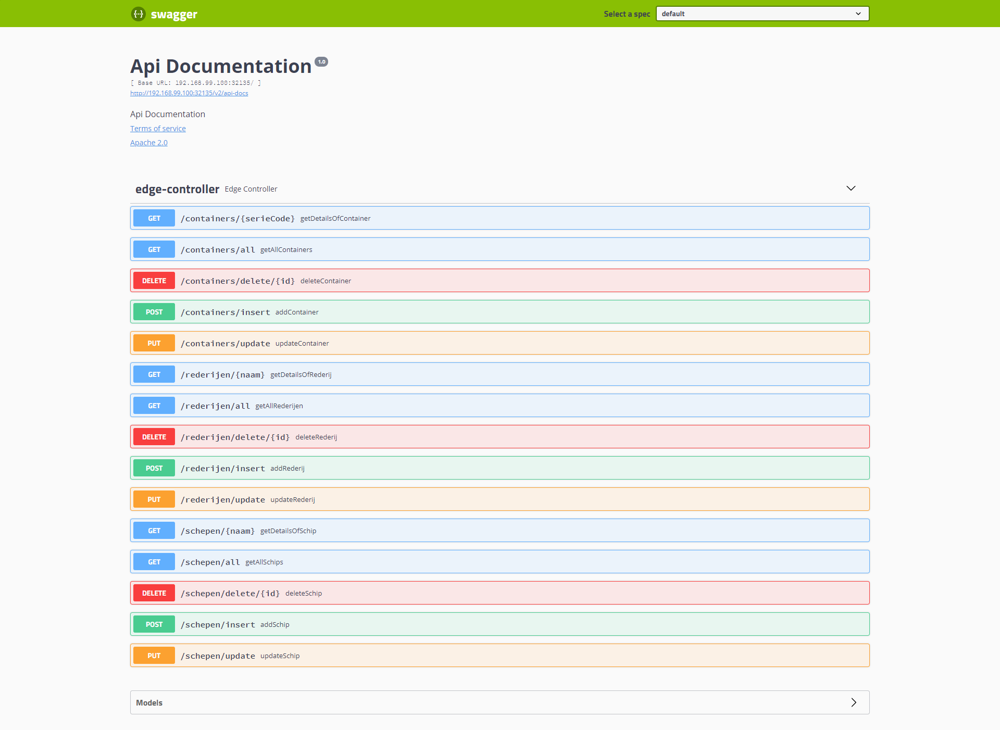

# Project-APT-Edge
Project APT Edge

## Thema
Ons thema is gebaseerd rond schepen, containers en rederijen. 
Rederijen beschikken over schepen en deze schepen vervoeren containers.

##  Links
* [containers](https://github.com/kevinhugens/Project-APT-Containers)
* [schepen](https://github.com/kevinhugens/Project-APT-Schepen)
* [rederijen](https://github.com/kevinhugens/Project-APT-Rederijen)
* [frontend](https://github.com/estebanbeerens/project-apt-frontend)

## Diagram

## Swagger-UI

